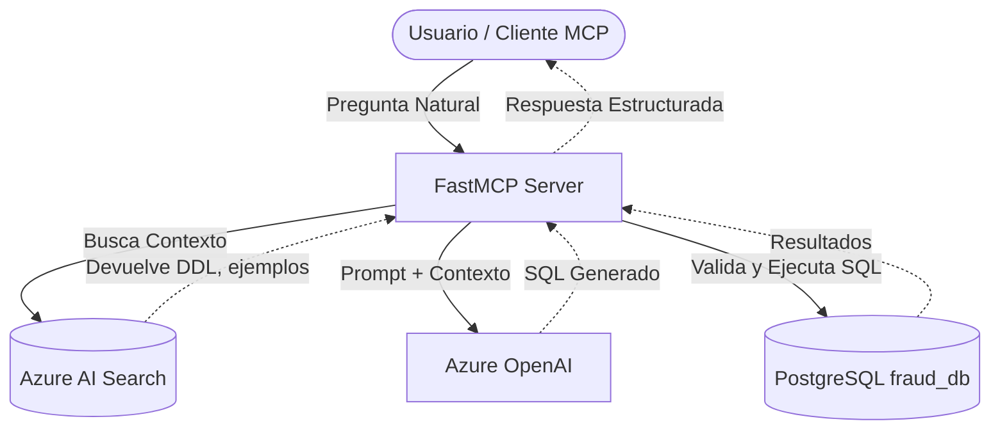

# Insight AI-SQL MCP Server

Servidor MCP (Model Context Protocol) en Python diseñado para consultar bases de datos PostgreSQL (ej. `fraud_db`) a partir de preguntas en lenguaje natural. El servidor recupera contexto técnico mediante Azure AI Search, genera consultas SQL de solo lectura utilizando Azure OpenAI, valida sintácticamente la consulta y, opcionalmente, la ejecuta contra la base de datos para devolver resultados estructurados y generar reportes ejecutivos.

## Objetivo y Casos de Uso

Este proyecto actúa como capa MCP para orquestar un flujo avanzado de SQL-RAG:

1. Recibe peticiones analíticas o preguntas de negocio del usuario.
2. Busca contexto semántico en Azure AI Search: estructura DDL, reglas de negocio, diccionarios de datos y ejemplos de consultas previas.
3. Construye un prompt optimizado inyectando el contexto recuperado.
4. Genera código SQL PostgreSQL nativo mediante Azure OpenAI.
5. Valida y asegura que la consulta generada sea de estrictamente de solo lectura.
6. Ejecuta la consulta y ensambla los resultados para su visualización o para la elaboración de informes ejecutivos multicapa.

## Arquitectura



## Herramientas MCP Disponibles

El servidor expone un conjunto de capacidades analíticas (definidas en `app/main.py`) diseñadas para ser consumidas por agentes de IA:

| Herramienta | Descripción |
| --- | --- |
| `get_context(question)` | Recupera desde Azure AI Search el contexto técnico relevante para estructurar una consulta SQL. |
| `generate_sql(question, debug=False)` | Genera una consulta SQL PostgreSQL de solo lectura. No la ejecuta contra la base de datos. |
| `ask_database(question)` | Genera SQL, aplica validaciones de seguridad, lo ejecuta en PostgreSQL y devuelve datos estructurados. |
| `generate_executive_report(...)` | Orquesta múltiples consultas SQL complejas para extraer métricas y generar reportes analíticos completos basados en datos duros. |
| `get_report_blueprint()` | Proporciona plantillas y arquitecturas de referencia para estandarizar la generación de informes ejecutivos. |

## Estructura del Proyecto

La solución sigue una arquitectura modular y orientada a servicios:

```text
app/
  main.py           # Punto de entrada del servidor MCP y panel de administración
  mcp_tools.py      # Orquestación e interfaz de las herramientas MCP
  rag_search.py     # Lógica de búsqueda vectorial en Azure AI Search
  sql_generator.py  # Construcción de prompts y generación de SQL con LLMs
  security.py       # Validación de AST (Abstract Syntax Tree) para SQL de solo lectura
  db.py             # Gestión de conexiones y ejecución segura en PostgreSQL
  indexer.py        # Pipeline de indexación de documentos hacia Azure AI Search
  config.py         # Carga y consolidación de configuraciones (.env y settings.yaml)
  user_store.py     # Gestión de usuarios del panel de administración (SQLite)
  query_store.py    # Persistencia de telemetría y consultas candidatas (SQLite)
  schemas.py        # Modelos Pydantic para la validación de estructuras
  admin/            # Panel web de administración (FastAPI, Jinja2, HTML/JS)

data/               # Bases de datos SQLite locales y documentación base
evaluation/         # Baterías de pruebas, evidencias de ejecución y análisis de calidad
requirements.txt    # Dependencias de Python
settings.yaml       # Configuración de negocio (límites, parámetros RAG, heurísticas)
startup.sh          # Script de arranque para entornos Unix
startup-windows.bat # Script de arranque para entornos Windows
```

## Requisitos y Configuración

El proyecto adopta un modelo de configuración dual para separar estrictamente los secretos de infraestructura de las reglas de negocio.

### Requisitos Previos
- Python 3.11 o superior.
- Entorno virtual de Python configurado.
- Acceso a servicios cognitivos y LLM (ej. Azure AI Search y Azure OpenAI).
- Conexión a base de datos PostgreSQL (soportado vía conexión directa o túneles de red).

### 1. Variables de Entorno (Secretos)
Las credenciales deben ubicarse en un archivo `.env` en la raíz del proyecto. Este archivo **nunca debe ser versionado**.

```env
# Configuración del Buscador Vectorial
AZURE_SEARCH_ENDPOINT=
AZURE_SEARCH_INDEX_NAME=
AZURE_SEARCH_API_KEY=

# Configuración del LLM
AZURE_OPENAI_ENDPOINT=
AZURE_OPENAI_API_KEY=
AZURE_OPENAI_API_VERSION=
AZURE_OPENAI_CHAT_DEPLOYMENT=
AZURE_OPENAI_EMBEDDING_DEPLOYMENT=

# Base de Datos Relacional
POSTGRES_HOST=
POSTGRES_PORT=5432
POSTGRES_DB=fraud_db
POSTGRES_USER=
POSTGRES_PASSWORD=

# Configuración de Servidor
SERVER_HOST=127.0.0.99
ADMIN_PORT=8000
ADMIN_SECRET_KEY=<clave_secreta_para_sesiones>
```

### 2. Configuración de Negocio (`settings.yaml`)
Reglas heurísticas y parámetros operativos que pueden ser ajustados sin comprometer credenciales:
- `sql.max_rows`: Límite defensivo de filas por consulta.
- `sql.max_retries`: Reintentos permitidos ante fallos de generación SQL.
- `rag.search_top_docs`: Número de documentos a recuperar en la fase de contexto.
- `rag.max_query_example_pct`: Proporción máxima de ejemplos históricos frente a metadatos técnicos.
- `reports.max_rows_per_section`: Límites de paginación para informes ejecutivos.

## Ejecución

Para iniciar el servidor unificado (MCP + Panel de Administración):

**Entornos Unix/Linux/macOS:**
```bash
python -m venv .venv
source .venv/bin/activate
pip install -r requirements.txt
./startup.sh
```

**Entornos Windows:**
```powershell
python -m venv .venv
.venv\Scripts\Activate.ps1
pip install -r requirements.txt
.\startup-windows.bat
```

**Endpoints expuestos (por defecto):**
- Conexión cliente MCP (SSE): `http://127.0.0.99:8000/mcp_server/mcp`
- Panel de Administración: `http://127.0.0.99:8000/admin/`

## Panel de Administración y Seguridad

El proyecto incluye un panel web interactivo diseñado para la validación humana (*Human-in-the-loop*) del SQL generado.

- **Acceso:** Protegido mediante autenticación por sesión (`Bcrypt` + HMAC). Por defecto, `admin` / `admin12345`.
- **Validación SQL:** Las consultas generadas atraviesan un analizador de sintaxis (`app/security.py`) que bloquea instrucciones mutables (`INSERT`, `UPDATE`, `DELETE`, `DROP`, `GRANT`, etc.). Las operaciones válidas se limitan forzosamente mediante inyección de cláusulas `LIMIT`.
- **Telemetría:** Todas las consultas se registran para alimentar el sistema de auditoría y mejorar iterativamente los ejemplos proporcionados en la fase RAG.

## Mejores Prácticas y Mantenimiento

Para mantener la fiabilidad en entornos de producción:
- Emplear roles de base de datos con permisos estrictos de solo lectura (`RO_USER`).
- Ajustar `SQL_MAX_RETRIES` y el comportamiento del agente según la latencia de la base de datos subyacente.
- Actualizar este documento tras la integración de nuevos modelos de datos, flujos de orquestación o dependencias estructurales.
